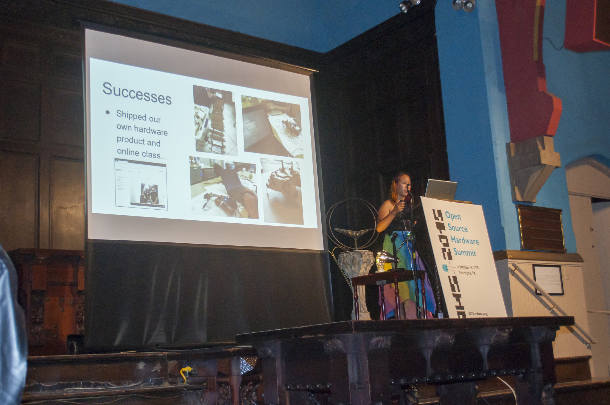

This website is mostly a potrfolio of projects; 

For a list of grants, talks, conferences, papers, press, leadership, teaching, volunteering, awards, etc.  the best bet is to take a look at my 1 page resume:
[Resume](resume_fa17.pdf)

or lengthier (overly so) 3 page CV.
[CV](CV_fa17.pdf)

